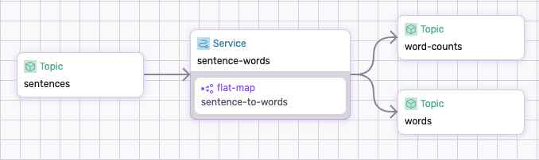

# Split Sentence - Package Variant

The package variant of the `split-sentence` dataflow, imports the functions from the [parse-sentence](../../../packages/parse-sentence/README.MD) and applies them to the dataflow. It split sentences into words and counts the number of characters. 

The following diagram is a visual representation of these operations generated by `sdf`:

<p align="center">
 
</p>


## Step-by-step

Take a look at the [dataflow.yaml](./dataflow.yaml) to get an idea of what we're doing.

### Compile the Package

Use the following command to compile the package:

```bash
(cd ../../../packages/parse-sentence && sdf build)
```

### Run the Dataflow

Use `sdf` command line tool to run the dataflow:

```bash
sdf run --dev --ui
```

Where:
  * `--dev` - runs the dataflow in development mode (reads the package from local file system).
  * `--ui` - generates the graphical representation and run the Studio web server.


### Test the Dataflow

The sample data file used to run this test `../sample-data/data.txt` has the following records:

```bash
Hello world
Hi there
```

Produce the data to the `sentences` topic:

```bash
fluvio produce sentences -f ../sample-data/data.txt
```

Checkout the data in `sentences` topic:

```bash
fluvio consume sentences -Bd
```

Consume from `words` to retrieve the result:

```bash
fluvio consume words -Bd
```

```bash
Hello
world
Hi
there
```

Consume from `word-counts` to retrieve the result:

```bash
fluvio consume word-counts -Bd
```

```bash
5
5
2
5
```

## Clean-up

Exit `sdf` terminal and clean-up. The `--force` flag removes the topics:

```bash
sdf clean --force
```

