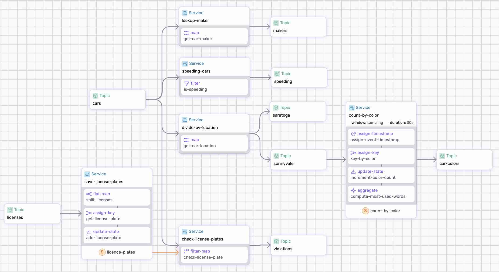

# Car Counter DataFlow

The car processing dataflow reads car events from the `cars` and `licenses` topics and performs a series of operations:

* Identify speeding vehicles (filter-map).
* Divide the events based on location (split).
* Count the cars based on color (tumbling windows).
* Identify stolen license plates (ref state).

The following diagram is a visual representation generated by `sdf`:

<p align="center">
 
</p>

## Event Generation

There are two event types generated by a couple of HTTP-source connectors streaming synthetic data from `data.infinyon.com`.


### Car Events Connector

The first connector reads `car events` at a rate of 2 events per second. The events model two semaphores, Saratoga and Sunnyvale, and produce the following information:

```json
{
  "maker": "Fiat",
  "model": "124 Spider",
  "category": "Convertible",
  "color": "beige",
  "license": "7WPK493",
  "fuel": "gasoline",
  "location": "Saratoga",
  "mph": 43,
  "timestamp": "2024-03-14T16:12:10.493Z"
}
```

This connector sends events to `cars` topic.

### License Plates Connector

The second connector reads car licenses every hour to emulate a database read of license places from an official organization such as the Department of Motor Vehicles (DMV).


```json
[
  {
    "maker": "Toyota",
    "model": "Camry",
    "license": "0VTI452"
  },
  {
    "maker": "Ford",
    "model": "Fusion",
    "license": "7YHM485"
  },
  ...
]
```

The connector sends events to `licenses` topic.

## Step-by-step

Take a look at the [dataflow.yaml](./dataflow.yaml) to get an idea of what we're doing.

Make sure to [Install SDF  Start a Cluster].

### 1. Run the Pipeline

Run the pipeline:

```bash
sdf run --ui
```

Use `--ui` to generate the graphical representation and run the Studio.

**Note:** The `check-license-plates` service uses Polars, a library that has not yet been optimized, and will it make take a while the compile. We'll optimize this in a future release.


### 2. Start the connectors:


In a new terminal change direcotry to `./connectors`, download the connector binary, and start 2 connectors:

```bash
cd ./connectors
cdk hub download infinyon/http-source@0.3.6
cdk deploy start --ipkg infinyon-http-source-0.3.6.ipkg -c license-connector.yaml
cdk deploy start --ipkg infinyon-http-source-0.3.6.ipkg -c car-connector.yaml
```

To see the events, run `fluvio consume cars`.

For additional context, checkout [connectors](./connectors/).


### 3. Check the results

In the `sdf` terminal, checkout the state maintained by the pipeline:

```bash
show state
```

We are intersted in the following:

```
 Namespace                                  Keys  Type
 save-license-plates/licence-plates/state   100   u32
 count-by-color/count-by-color/state        5     u32
 count-by-color/count-by-color/watermark    1     timestamp
```

#### License Plates State

License Plates state stores the license plates read from the `licenses` topic. This is used to check for stolen plates later in the pipeline.

```bash
show state save-license-plates/licence-plates/state --table
```

```
 Key      maker          model
 0FDR715  Buick          Encore
 0FJV738  Ford           Explorer
 0FQP572  Tesla          Model S
 0GFX265  Volvo          V90
 ...
```

#### Count by Color State

Count by color state keep strack of the number of cars for each color.

```bash
show state count-by-color/count-by-color/state
```

You'll notice the number of cars for each color in the active window. This window is still collecting data and it has not yet been closed and flushed.

```
 Key     Window                                     Value
 beige   2024-04-16T01:38:00Z:2024-04-16T01:38:30Z  6
 black   2024-04-16T01:38:00Z:2024-04-16T01:38:30Z  4
 green   2024-04-16T01:38:00Z:2024-04-16T01:38:30Z  3
 grey    2024-04-16T01:38:00Z:2024-04-16T01:38:30Z  4
 orange  2024-04-16T01:38:00Z:2024-04-16T01:38:30Z  2
 perl    2024-04-16T01:38:00Z:2024-04-16T01:38:30Z  4
 red     2024-04-16T01:38:00Z:2024-04-16T01:38:30Z  2
 white   2024-04-16T01:38:00Z:2024-04-16T01:38:30Z  4
 yellow  2024-04-16T01:38:00Z:2024-04-16T01:38:30Z  3
```

The window is flushed to the `car-colors` topic every 30 seconds.


#### Watermark

Watermark tracks the cutoff timestamp for tumbling windows.

```bash
>> show state count-by-color/count-by-color/watermark
 Key      Value                     Window
 default  2024-03-15T13:44:30.043Z  *
```

This is used to determine when to flush window state for the tumbling window that counts the cars by color, flushing state to the 'car-colors' topic.


#### Car Makers

Each car event triggers an `http call-out` to gather additional information about the car maker. Consume from the `makers` topic to see the results:

```bash
fluvio consume makers -Bd -O json
```

The maker continent is returned:

```
{"continent":"Europe","country":"Germany","maker":"Audi"}
{"continent":"Europe","country":"United Kingdom","maker":"McLaren"}
{"continent":"Europe","country":"Italy","maker":"Fiat"}
...
```


#### Speeding Cars

Consume from `speeding` to see all cars driving faster than `45 mph`:

```bash
fluvio consume speeding -O json
```

```text
Consuming records from 'speeding'
{
  "color": "beige",
  "license": "6ZVM807",
  "location": "Sunnyvale",
  "maker": "Lincoln",
  "model": "Navigator",
  "mph": 63,
  "timestamp": "2024-04-20T17:07:09.851Z"
}
...
```

Hit <Ctrl-C> to exit.


#### Split Traffic

The dataflow splits the traffic into 2 locations, `sunnyvale`, and `saratoga`. Consume from `sunnuvale` to see the cars:

```bash
fluvio consume sunnyvale
```

```
Consuming records from 'sunnyvale'
{"car":"Tesla Model Y","color":"yellow","location":"Sunnyvale"}
{"car":"Smart Fortwo","color":"yellow","location":"Sunnyvale"}
{"car":"Honda Accord","color":"orange","location":"Sunnyvale"}
...
```

Hit <Ctrl-C> to exit.


Consume from `Saratoga` to see the cars:

```bash
fluvio consume saratoga
```

```
Consuming records from 'saratoga'
{"car":"Subaru BRZ","color":"green","location":"Saratoga"}
{"car":"Mazda Mazda3","color":"beige","location":"Saratoga"}
{"car":"Chevrolet Blazer","color":"beige","location":"Saratoga"}
...
```

Hit <Ctrl-C> to exit.


#### Count Cars

Count all cars seen at the Sunnyvale location by colors. As mentioned above, the cars are counted and flushed to the `car-colors` topic every 30 seconds.

```bash
fluvio consume car-colors -B -O json
```

```
Consuming records from 'car-colors'
[
  {
    "color": "perl",
    "count": 3
  },
  {
    "color": "green",
    "count": 2
  },
  ...
```

Hit <Ctrl-C> to exit.


#### Detect Annomalies

The pipeline also detects anomalies by check if a license plate is seen in 2 different cars. To demonstrate this functionality, we are ingesting a data set that send an annomaly every 10 records (~5 sec).

```bash
fluvio consume violations -B -O json
```

```
Consuming records from 'violations'
{
  "license": "1KFR357",
  "owner": "Maserati Quattroporte",
  "violator": "Chevrolet Equinox"
}
{
  "license": "0FQP572",
  "owner": "Land Rover Discovery",
  "violator": "Tesla Model S"
}
{
  "license": "2RFQ375",
  "owner": "Audi Q7",
  "violator": "Infiniti Q50"
}
```

Hit <Ctrl-C> to exit.

For simplicity, the code assumes that the first car is always the owner, and the 2nd is the violator.

Congratulations! You've successfully built and run a dataflow!

## Clean-up

Note that your connectors will continue to run in the background until you shut them down:

```bash
cdk deploy shutdown --name car-connector
cdk deploy shutdown --name license-connector
```

Type `exit` in the sdf terminal to close the process and delete the topics:

```bash
fluvio topic delete cars
fluvio topic delete makers
fluvio topic delete speeding
fluvio topic delete saratoga
fluvio topic delete sunnyvale
fluvio topic delete car-colors
fluvio topic delete licenses
fluvio topic delete violations
```


[Install SDF & Start a Cluster]: /README.MD#prerequisites