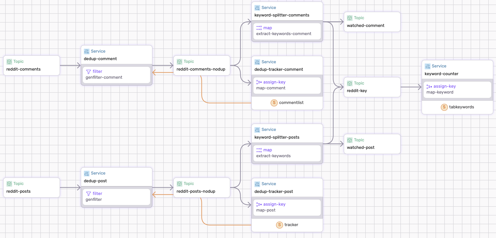
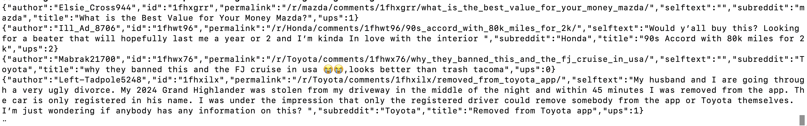

<<<<<<< Updated upstream
# Reddit Subreddit Streamer
This example with stream new posts from different subreddits using the endpoint **https://www.reddit.com/r/.../new.json**. This is influenced by [x-sushant-x's entry in Quira](https://github.com/x-sushant-x/reddit-streamer-fluvio/tree/master). However, everything is containerized with fluvio's technology with connectors and SDF. The project consists of a script that generates connectors as well a watcher that allows for you to watch for certain keywords found in reddit posts.

## Topics

The project will generate four topics and two states.
#### Topics
- `reddit-sub-posts`: This topic contains all the entries generated by the connectors.
- `reddit-nodup`: The connector does not have a no duplication smart connector in it. (Maybe add on?) So SDF is used to implement this feature. All entries are unique in this topic(unless you produce data into it)
- `reddit-key`: This is just a stream of all the keywords
- `watched-posts`: This stream contains all the posts on the selected subreddit that includes the keywords.
#### States
- `tracker`: This state contains all the entries of `reddit-nodup`.
- `tabkeywords`: This state contains the tabulatation of all the keywords from all subreddits.

## Running the whole project
A makefile is included for your convenience.
 - `build` will run the whole project. 
 - `clean` will clean the files generated by sdf and the connector script
 - `connectors` will start connectors. There is a default list of subreddits watched.
#### Custom Configurations
In the Makefile, the first few lines defines the subreddits connectors generated by the generator file as well as the keywords that are being watched.

```
WATCHING_VAR ?= rust,fluvio,infinyon
SUBS ?= rust,test,
```
Edit `WATCHING_VAR` to edit the default keywords that are watched and `SUBS` to change what subreddit is being connected to. The subreddit test [https://www.reddit.com/r/test/][https://www.reddit.com/r/test/] allows you to post without cooldown or any other constraints.

## Starting the connectors
By running the generator.sh script we are able to start a connector to any subreddit via
```
./generator Honda
```
Or to start multipe subreddits use comma-separated
```
./generator Honda,Toyota,Mazda
```
The script will generate a connector file. It will also automatically install all the packages necessary. The connector extracts the newest post via the jolt. Other params from the reddit request are available and the `generator` script can be edit to include them. The full list is in the bottom of the README. 

The connector will produce for only the `reddit-sub-posts` topic. It has no deduplication.

## Stateful for deduplication
A stateful service is included for deduplication. The way it works is by first checking if the state has said entry via the post's id:
- if it has it: it means it is duplicated
- if it doesnt: it means its the first occurance

#### Example Output of dedup


## Clean up
The connectors can add up and get pretty annoying. A clean script `cleanconn` is included to remove all running and stopped connectors. **It removes all connectors!**

## Problems
1. The endpoint actually is a dump of x amount of new posts for a subreddit and can get really big. Sometimes things don't work out or lag a lot. I may be good to edit the interval that the connector polls the subreddit. It may also be helpful to run the sdf first and the connector separately. In terminal one,
```
make sdf
```
And in terminal two
```
make connectors
```

2. The connector is not suitable for reading subreddits that are very active and get more than one posts per five seconds. You can edit the interval it polls at. It can only read the new post.

3. The connector will read old posts if the new post is removed.
4. In this example, keyword extraction is done by breaking whitespaces and punctuation up. There is an example of better keyword detection via hugging face's classifier. The code can be found here [non-working dataflow](zzzz_WIP/intelligentflow.yaml). It has not been tested, but modifying the function `extract_keywords` in the dataflow could sufficiently allow better keyword detection.
```
fn extract_keywords(post: RedditObj) -> Result<(Option<String>,String) > {
            use sdf_http::http::{Request, header};
            use serde_json::Value;
            use regex::Regex;

            let url = "https://api-inference.huggingface.co/models/vblagoje/bert-english-uncased-finetuned-pos";
            let token = "....."; //insert ur token here
            
            let re = Regex::new(r"[[:punct:]]").unwrap();
            let post_title = re.replace_all(&post.title, "").to_string();
            let post_body = re.replace_all(&post.selftext, "").to_string();
            let body = format!( "{{\"inputs\": \"{}. {}\"}}", post_title,post_body);

            let request = Request::builder()
                .method("POST")
                .uri(url)
                .header(header::CONTENT_TYPE, "application/json")
                .header(header::AUTHORIZATION, format!("Bearer {}",token)) 
                .body(body)?;
            let response = sdf_http::blocking::send(request)?;
            let mut listObj= String::from_utf8(response.into_body())?;
            listObj = listObj.replace("#", "");
            let mut keywords: String = String::new();
            let entities: Vec<Value>= serde_json::from_str(&listObj)?;  
            //Ok((Some(post.id),listObj))
            for entity in entities {
                if let Some(entity_group) = entity.get("entity_group") {
                    if let Some(entity_group_str) = entity_group.as_str() {
                        if entity_group_str == "NOUN" || entity_group_str == "PROPN" {
                            if let Some(word) = entity.get("word") {
                                if let Some(word_str) = word.as_str() {
                                    if !keywords.is_empty()  { keywords.push('#'); }
                                    keywords.push_str(word_str);
                                }
                            }
                        }
                    }
                }
            }
            Ok((Some(post.id),keywords))
          }
}
```

## Full body of request
The reddit object will return the following, please edit the generator if you find any of the information useful or necessary.
=======
e reddit object will return the following, please edit the yaml if you find any of the information useful or necessary.
>>>>>>> Stashed changes
```
"approved_at_utc": null,
"subreddit": "test",
"selftext": "test",
"author_fullname": "t2_idma42ut",
"saved": false,
"mod_reason_title": null,
"gilded": 0,
"clicked": false,
"title": "test",
"link_flair_richtext": [],
"subreddit_name_prefixed": "r/test",
"hidden": false,
"pwls": 6,
"link_flair_css_class": null,
"downs": 0,
"thumbnail_height": null,
"top_awarded_type": null,
"hide_score": true,
"name": "t3_1fg4o4m",
"quarantine": false,
"link_flair_text_color": "dark",
"upvote_ratio": 1,
"author_flair_background_color": null,
"subreddit_type": "public",
"ups": 1,
"total_awards_received": 0,
"media_embed": {},
"thumbnail_width": null,
"author_flair_template_id": null,
"is_original_content": false,
"user_reports": [],
"secure_media": null,
"is_reddit_media_domain": false,
"is_meta": false,
"category": null,
"secure_media_embed": {},
"link_flair_text": null,
"can_mod_post": false,
"score": 1,
"approved_by": null,
"is_created_from_ads_ui": false,
"author_premium": false,
"thumbnail": "self",
"edited": false,
"author_flair_css_class": null,
"author_flair_richtext": [],
"gildings": {},
"content_categories": null,
"is_self": true,
"mod_note": null,
"created": 1726259389,
"link_flair_type": "text",
"wls": 6,
"removed_by_category": null,
"banned_by": null,
"author_flair_type": "text",
"domain": "self.test",
"allow_live_comments": false,
"selftext_html": "&lt;!-- SC_OFF --&gt;&lt;div class=\"md\"&gt;&lt;p&gt;test&lt;/p&gt;\n&lt;/div&gt;&lt;!-- SC_ON --&gt;",
"likes": null,
"suggested_sort": null,
"banned_at_utc": null,
"view_count": null,
"archived": false,
"no_follow": false,
"is_crosspostable": false,
"pinned": false,
"over_18": false,
"all_awardings": [],
"awarders": [],
"media_only": false,
"can_gild": false,
"spoiler": false,
"locked": false,
"author_flair_text": null,
"treatment_tags": [],
"visited": false,
"removed_by": null,
"num_reports": null,
"distinguished": null,
"subreddit_id": "t5_2qh23",
"author_is_blocked": false,
"mod_reason_by": null,
"removal_reason": null,
"link_flair_background_color": "",
"id": "1fg4o4m",
"is_robot_indexable": true,
"report_reasons": null,
"author": "LucidDream9590",
"discussion_type": null,
"num_comments": 0,
"send_replies": true,
"whitelist_status": "all_ads",
"contest_mode": false,
"mod_reports": [],
"author_patreon_flair": false,
"author_flair_text_color": null,
"permalink": "/r/test/comments/1fg4o4m/test/",
"parent_whitelist_status": "all_ads",
"stickied": false,
"url": "https://www.reddit.com/r/test/comments/1fg4o4m/test/",
"subreddit_subscribers": 23859,
"created_utc": 1726259389,
"num_crossposts": 0,
"media": null,
"is_video": false
```
