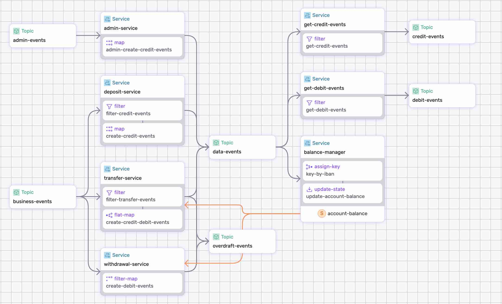

# Bank Processing DataFlow

The bank processing dataflow ingests business events such as deposits, withdrawals, or transfers, transforms them into debit and credit events, computes the balance for each account.

In addition, the dataflow detects insufficient funds and sends an events to an `overdraft` topic.


<p align="center">
 
</p>

## Dataflow Primitives

The dataflow uses the following primitives:

* _map_
* _filter_
* _filter-map_
* _flat-map_
* _assign-key_
* _update-state_
* _states_ (ref-state)

It also shows the ability to split traffic, by sending records to different topics.


## Step-by-step

* Take a look at the [dataflow.yaml](./dataflow.yaml) to get an idea of what we're doing.
* Make sure to [Install SDF & Start a Cluster].

### 1. Run the Dataflow

Use `sdf` command line tool to run the dataflow:

```bash
sdf run --ui
```

Use `--ui` to open the Studio.


### 2. Test the Dataflow

Use `fluvio consume` command to read from multiple streams in parallel:

* `admin-events`
* `business-events`
* `data-events`
* `debit-events`
* `credit-events`
* `overdraft-events`


#### 2.1 Add Account

Use fluvio produce to publish `add-account` events for `duncan` and `lucy` to the `admin-events` topic :

```bash
fluvio produce admin-events --raw --file ./sample-data/add-account-duncan.json
fluvio produce admin-events --raw --file ./sample-data/add-account-lucy.json
```

Check the state in the `sdf` terminal:

```bash
show state balance-manager/account-balance/state
```

```bash
 Key                     Window  balance  name
 GB36MWIE43141216656969  *       2500     Lucy Cechtelar
 GB56DVTE70858022060682  *       1000     Duncan Taylor

```

Check the fluvio topics to see the processed records:

```bash
fluvio consume admin-events -Bd -O json
fluvio consume data-events -Bd -O json
fluvio consume credit-events -Bd -O json
```

#### 2.2 Deposit

Use fluvio produce to publish `deposit` events for `duncan` and `lucy` to the `business-events` topic :

```bash
fluvio produce business-events --raw --file ./sample-data/deposit-duncan.json
fluvio produce business-events --raw --file ./sample-data/deposit-lucy.json
```

Check the state in `sdf` terminal:

```bash
show state balance-manager/account-balance/state
```

```bash
 Key                     balance  name
 GB36MWIE43141216656969  2700     Lucy Cechtelar
 GB56DVTE70858022060682  1500     Duncan Taylor
```


#### 2.3 Withdrawal

Use fluvio produce to publish `withdrawal` events for `duncan` and `lucy` to the `business-events` topic :

```bash
fluvio produce business-events --raw --file ./sample-data/withdrawal-duncan.json
fluvio produce business-events --raw --file ./sample-data/withdrawal-lucy.json
```

Check the state in `sdf` terminal:

```bash
show state balance-manager/account-balance/state
```

```bash
 Key                     balance  name
 GB36MWIE43141216656969  2660     Lucy Cechtelar
 GB56DVTE70858022060682  720      Duncan Taylor
```


#### 2.4 Transfer

Use fluvio produce to publish `tranfer` events for `duncan` to `lucy` to the `business-events` topic :

Transfer from `duncan` to `lucy`:

```bash
fluvio produce business-events --raw --file ./sample-data/transfer-duncan-to-lucy.json
```

Check the state in `sdf` terminal:

```bash
show state balance-manager/account-balance/state
```

```bash
 Key                     balance  name
 GB36MWIE43141216656969  2710     Lucy Cechtelar
 GB56DVTE70858022060682  670      Duncan Taylor
```

Transfer from `lucy` to `duncan`:

```bash
fluvio produce business-events --raw --file ./sample-data/transfer-lucy-to-duncan.json
```

Check the state in `sdf` terminal:

```bash
show state balance-manager/account-balance/state
```

```bash
 Key                     balance  name
 GB36MWIE43141216656969  2610     Lucy Cechtelar
 GB56DVTE70858022060682  770      Duncan Taylor
```

Check the fluvio topics to see the processed records:

```bash
fluvio consume credit-events -Bd -O json
fluvio consume debit-events -Bd -O json
```

#### 2.5 Overdraft

To trigger an overdraft, withdraw additinal funds from Duncan:

Withdrawal `duncan`:

```bash
fluvio produce business-events --raw --file ./sample-data/withdrawal-duncan.json
```

Check the state in `sdf` terminal:

```bash
show state balance-manager/account-balance/state
```

```bash
 Key                     balance  name
 GB36MWIE43141216656969  2610     Lucy Cechtelar
 GB56DVTE70858022060682  -10      Duncan Taylor
```

Check the fluvio topic to see the ovedraft records:

```bash
fluvio consume overdraft-events -Bd -O json
```

Congratulations! You've successfully built and run a dataflow!


### Clean-up

Exit `sdf` terminal and clean-up. The `--force` flag removes the topics:

```bash
sdf clean --force
```

[Install SDF & Start a Cluster]: /README.MD#prerequisites
