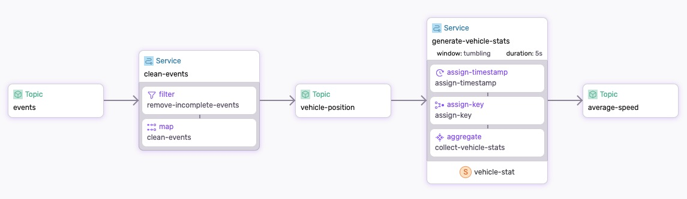

# Helsinki Transit Dataflow

The Helsinki transit dataflow uses MQTT to ingests data from the Helsinki transit API and then processes the data to provide insights into the transit system. The purpose of the dataflow is to demonstrate how to use the SQL interface to analyze the data.

The following diagram is a visual representation generated by `sdf`:

<p align="center">
 
</p>

The dataflow has two services:
* `clean-events` removes events with incomplete data
* `generate-vehicle-stats` generates average speed per vehicle every 5 seconds.


## Step-by-step

Take a look at the [dataflow.yaml](./dataflow.yaml) to get an idea of what we're doing.

Make sure to [Install SDF and Start a Cluster].

### 1. Run the Dataflow

Use `sdf` command line tool to run the dataflow:

```bash
sdf run --ui
```

* Use `--ui` to generate the graphical representation and run the Studio.
* Using `sdf run` as opposed to `sdf deploy` will run the dataflow with an ephemeral worker, which will be cleaned up on exit.


### 2. Start the mqtt connector:

In a new terminal change directory to `./connectors`, download the connector binary, and start connector:

```bash
cd ./connectors
fluvio hub smartmodule download infinyon/jolt@0.4.1
cdk hub download infinyon/infinyon/mqtt-source@0.2.9
cdk deploy start --ipkg infinyon-mqtt-source-0.2.9.ipkg -c mqtt-helsinki.yaml
```

To see the events, run `fluvio consume helsinki`.

For additional context, checkout [connectors](./connectors/).


### 3. Check the results

In the `sdf` terminal, checkout the state maintained by the dataflow:

```bash
show state
```

We are interested in the following state:

```bash
show state generate-vehicle-stats/vehicle-stat/state
```

#### Use SQL to query the state

Let's say we want to analyze the top 10 vehicles by average speed. We can use the SQL interface to query the state.

To enter the SQL interface, run:

```bash
>> sql
```

Let's start by showing the tables:

```sql
show tables
```

There are two tables, but in this example we are interested in the `license_plates` table.
Let's run a simple select:

```sql
select * from vehicle_stat
```

Now we can look-up top 5 vehicles by speed:

```sql
select * from vehicle_stat order by speed desc limit 5
```

When you are done, exit the SQL interface with `.exit`.


#### Check the output topic

In our dataflow example, we are producing the average speed for all vehicles to the `average-speed` topic.

```bash
fluvio consume average-speed -O json
```

If we decide to change the dataflow to give us the top 5 vehicles by speed, all we need to do is update the SQL statement in the `collect_vehicle_stats` function:

```rust
let vs = sql("select * from vehicle_stat order by speed desc limit 5")?;
```

Then run the service again using `sdf run`.  Checking the output again, you will notice that the output has changeed. It only returns the top 5 vehicles by speed:

```bash
fluvio consume average-speed -O json
```

:tada: Congratulations! You have just learned how to use the SQL interface to analyze the data and improve your dataflow based on your analysis.

[Install SDF and Start a Cluster]: /README.MD#prerequisites