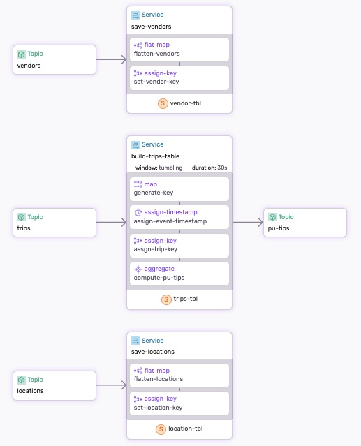
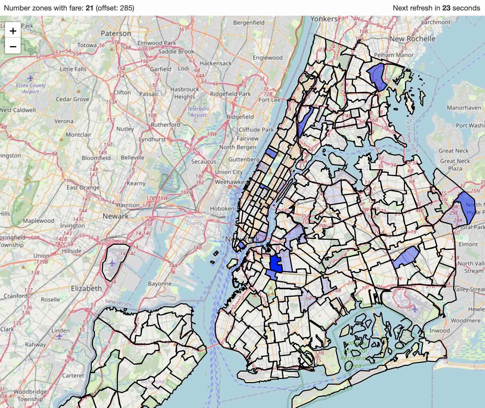

# NY Transit dataflow

he New York transit dataflow demonstrates how to create tables, use the SQL query interface to analyze the data, and launch a visualization tool to evaluate the results."

The source of the data and the schemas can be found at the following links:

* [TLC Trip Record Data](https://www.nyc.gov/site/tlc/about/tlc-trip-record-data.page)
* [Data Dictionary for Trip Records](https://www.nyc.gov/assets/tlc/downloads/pdf/data_dictionary_trip_records_hvfhs.pdf)

## The Dataflow 

The [dataflow.yaml](./dataflow.yaml) defines three services that handle the `save-vendors`, `save-locations`, and `build-trips-table data`. The vendors and locations topics store static data, while the trips topic stores event data.

The `build-trips-table` service performs two key functions:

* It creates a `trips_tbl`, which is refreshed every 30 seconds.
* It computes the average tips per zone and writes the result to `pu-tips` topic (`pu` = Pick-up).

<p align="center">
 
</p>

The `pu-tips` topic is used by the visualization tool to display the average tips per zone. The darker the color, the higher the average tip.

<p align="center">
 
</p>


## Step-by-step

Make sure to [Install SDF and start a Fluvio cluster].

### 1. Run the Dataflow

Use `sdf` command line tool to run the dataflow:

```bash
sdf run --ui
```

* Use `--ui` to generate the graphical representation and run the Studio.
* Using `sdf run` as opposed to `sdf deploy` will run the dataflow with an ephemeral worker, which will be cleaned up on exit.

**Note:** It is important to run the dataflow first, as it creates the topics for you.

### 2. Read the locations & the zones:

Read locations from the data generator and add them to the `locations` topic:

```bash
curl -s https://demo-data.infinyon.com/api/ny-transit/locations | fluvio produce locations
```

Read vendors from the data generator and add them to the `vendors` topic:

```bash
curl -s https://demo-data.infinyon.com/api/ny-transit/vendors | fluvio produce vendors
```

### 2. Start the http connector:

In a new terminal change directory to `./connectors`, download the connector binary, and start connector:

```bash
cd ./connectors
cdk hub download infinyon/http-source@0.4.3
cdk deploy start --ipkg infinyon-http-source-0.4.3.ipkg -c trips-connector.yaml
```

The NY transit connector receives 10 events per second. Use fluvio to see the events streaming in real-time:

```bash
fluvio consume trips
```

Use <Ctrl-C> to exit


### 3. Use SQL interface to explore the `trips_tbl` table

The dataflow creates the `trips_tbl` table that gets refreshed every 30 seconds.

SDF offers a `sql` interface to explore the table. Just type `sql` in the terminal to get started:

```bash
>> sql
```

To show tables, type `show tables;` and hit enter:

```sql
SHOW tables
```

Let's compute total fares, tips, tolls, and driver_pay for all rides:

```sql
SELECT 
  count(*) AS rides, 
  sum(`base-passenger-fare`), 
  sum(tips), 
  sum(tolls), 
  sum(`driver-pay`)
FROM 
  trips_tbl
```

Or identify the number of riders who paid congestion surcharge:

```sql
SELECT 
  count(*) AS rides, 
  sum(`base-passenger-fare`), 
  sum(`congestion-surcharge`)
FROM trips_tbl t 
WHERE t.`congestion-surcharge` > 0
```

If we are a driver, we want to know whe pick-up zone that has the highest average tip:

```sql
SELECT 
  `pu-location-id` AS pu_zone, 
  avg(tips) as average_tip 
FROM trips_tbl 
WHERE tips > 0.0
GROUP BY `pu-location-id`
ORDER BY average_tip DESC
```

Unfortunately, the pick-up zone is not human-readable, but we can join the `trips_tbl` table with the `location_tbl` table to get the zone name:

```sql
SELECT
  `pu-location-id` AS pu_zone,
  l.zone as pu_zone_name,
  avg(tips) as average_tip 
FROM trips_tbl t
JOIN location_tbl l
ON t.`pu-location-id` = l.location
WHERE tips > 0.0
GROUP BY l.zone, `pu-location-id`
ORDER BY average_tip DESC
```

We are also interested in determining which vendor receives the highest average tip—Uber or Lyft. To achieve this, we need to perform a 3-way join between the `trips_tbl`, `location_tbl`, and `vendor_tbl` tables:

```sql
SELECT
  `pu-location-id` AS pu_zone,
  l.zone as pu_zone_name,
  avg(tips) as average_tip,
  v.name as vendor
FROM trips_tbl t
JOIN location_tbl l
  ON t.`pu-location-id` = l.location
JOIN vendor_tbl v
  ON t.`hvfhs-license-num` = v._key
WHERE tips > 0.0
GROUP BY l.zone, `pu-location-id`, v.name
ORDER BY average_tip DESC
```


Feel free to explore the data further.

To exit the `sql` interface, type `.exit`.


### 5. Visualize the data

While tables are useful, they can be challenging to interpret. That's why we developed a visualization tool to make understanding the data easier and more intuitive.

Navigate to the [visualization](./visualization/) directory and follow the instructions to run the visualization tool.


### Clean-up

Exit `sdf` terminal and clean-up. The `--force` flag removes the topics:

```bash
sdf clean --force
```

Stop the connector:

```bash
cdk deploy shutdown --name trips-connector
```


[Install SDF and start a Fluvio cluster]: /README.MD#prerequisites
